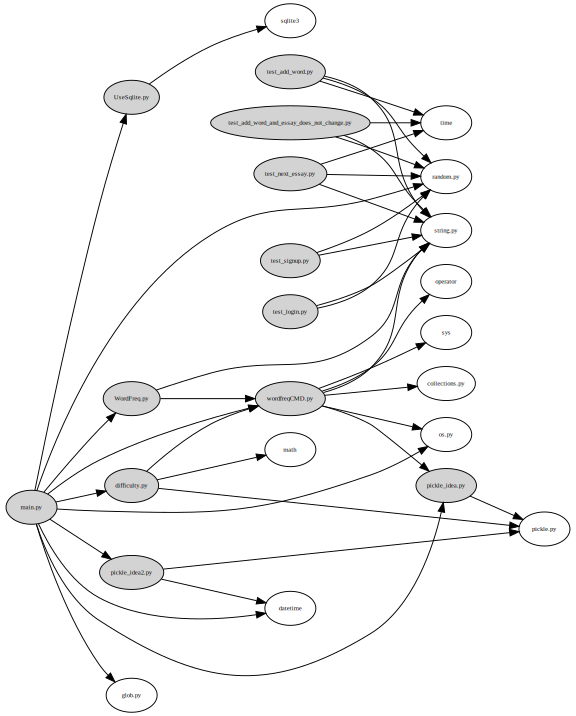

Results
=========

实验中生成依赖图的代码已在附件中给出，
这里我将依次展示模块间依赖图、各模块的类/函数依赖图、总类/函数依赖图。

    
    module-level dependency
    

    main.py class/function-level dependency
    

    useSqlite.py class/function-level dependency
    

    pickle_idea.py & pickle_idea2.py class/function-level dependency
    

    WordFreq.py & wordfreqCMD.py class/function-level dependency
    

    difficulty.py
    

    class/function-level dependency